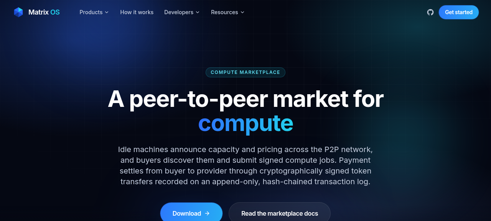
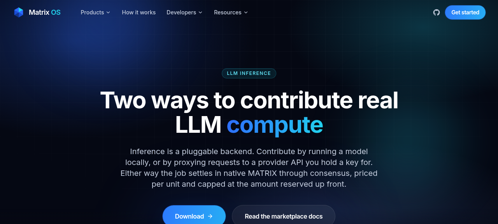
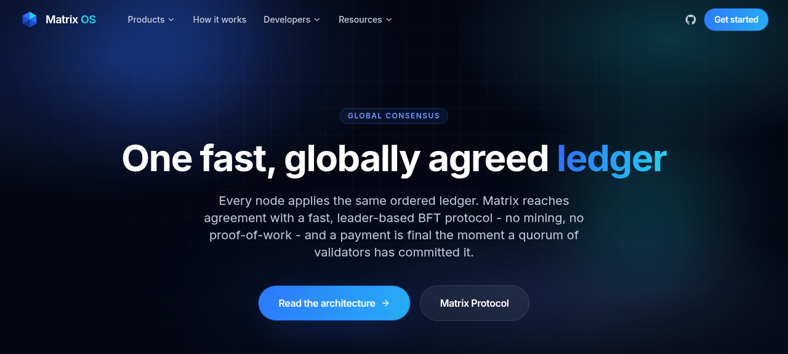
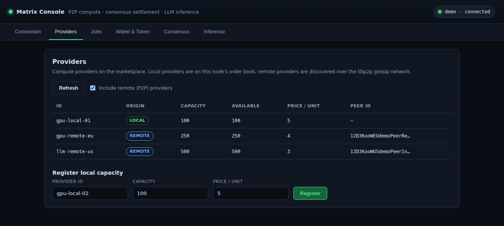

# Matrix OS

Matrix OS is a peer-to-peer network for decentralized LLM compute. People leave their
idle computers running to join the network like a blockchain node and contribute LLM
compute to the network. Anyone can buy LLM compute and API responses with
cryptocurrency, and the people who provide compute get paid by the network.

This repository is a polyglot monorepo that consolidates the Matrix OS projects into a
single tree. Each subproject keeps its own toolchain and its own README; this root
document describes the layout and how to build and test each piece.

## Monorepo layout

- [`services/core`](services/core/README.md) - Matrix Core, the Go P2P daemon that turns any machine into a Matrix node.
- [`proto`](proto/README.md) - Matrix Proto, the buf-managed Protocol Buffers definitions shared across the network.
- [`apps/web`](apps/web) - the Next.js marketing website (ecirlabs-web).
- [`apps/console`](apps/console/README.md) - Matrix Console, a Tauri + React + TypeScript + Vite desktop app that connects to a local `matrixd` node to observe and control the marketplace (providers, jobs, wallet/token, consensus, and LLM inference).
- [`contracts`](contracts/README.md) - the Hardhat project for wMATRIX, the bridged ERC-20 mirror of the native MATRIX coin that lets the asset list on exchanges (the native coin on the Go L1 remains the single source of truth for balances).
- [`packages/protocol`](packages/protocol) - the one TypeScript implementation of the wire byte layouts a client signs over (payment digests, run authorizations, message digests). It exists because those layouts were copied into three places and a drift between any copy and the Go verifier is a signature the node rejects for no visible reason.
- [`packages/sdk`](packages/sdk) - the TypeScript client SDK. Its layout-parity test signs randomized inputs through both this package and the Go encoder and fails on a single differing byte.

## Screenshots

Five screenshots, one per distinct claim: what the network is, the two sides of its market,
what makes balances agreed rather than local, and the desktop app actually running. Native
MATRIX is the coin of the Go consensus L1 and the single source of truth for balances,
capped at 1,000,000,000 whole MATRIX at 9 decimals; wMATRIX is the bridged ERC-20 mirror
that lets the asset list on exchanges, and is not the settlement token. Images live in
[`docs/screenshots`](docs/screenshots).

### Marketing site (`apps/web`)


*The home page: the peer-to-peer market for compute and inference, routing out to the
product pages.*


*Compute Marketplace: peer-to-peer capacity announce and discovery over libp2p, with signed
jobs that settle in native MATRIX.*


*LLM Inference: the other half of the market, fulfilled by a local runner or a provider-API
proxy and settled through the same consensus path as compute.*


*Consensus: fast leader-based BFT, so a balance is one globally agreed fact rather than a
private per-node number.*

### Console (`apps/console`)


*Matrix Console: providers, jobs, native MATRIX wallet, consensus and inference tabs in one
window, here on the Providers tab showing local and remote capacity with the peer ids they
were discovered from - the whole thing running.*

## Repository tooling

A root [`go.work`](go.work) ties the Go modules (`services/core` and `proto`) together so
they resolve consistently in workspace mode. A single merged [`.gitignore`](.gitignore)
covers the build artifacts of every subtree.

## Build and test

Each toolchain is invoked from its own subdirectory.

### Go - `services/core`

```sh
cd services/core
go build ./...
go test ./...
```

### Protocol Buffers - `proto`

```sh
cd proto
buf lint
buf generate
```

### Web - `apps/web`

```sh
cd apps/web
corepack yarn install --frozen-lockfile
corepack yarn lint
corepack yarn build
```

### Console - `apps/console`

```sh
cd apps/console
corepack yarn install
corepack yarn build   # tsc --noEmit && vite build -> dist/
corepack yarn dev     # Vite dev server on http://localhost:5173
```

The console is a Tauri + React + Vite desktop app. The web frontend builds and
runs everywhere; the native desktop bundle (`corepack yarn tauri build`)
additionally needs the WebKitGTK/libsoup system libraries. See the
[console README](apps/console/README.md) for the connection configuration and
the documented native-build limitation.

### Contracts - `contracts`

```sh
cd contracts
npm install
npx hardhat compile
npx hardhat test
```

### SDK - `packages/sdk`

```sh
cd packages/sdk
corepack yarn install --frozen-lockfile
corepack yarn typecheck
corepack yarn test    # includes the layout-parity differential test
corepack yarn build
```

`packages/protocol` has no build of its own: it is consumed as TypeScript source
by the web app and mirrored by the SDK, and the parity test above is what keeps
the mirror honest.

## License

Matrix OS is [MIT licensed](LICENSE).
