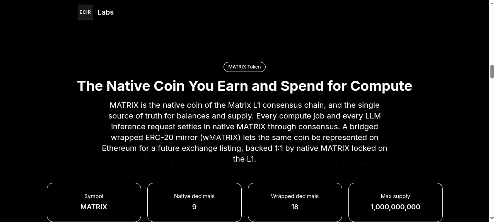
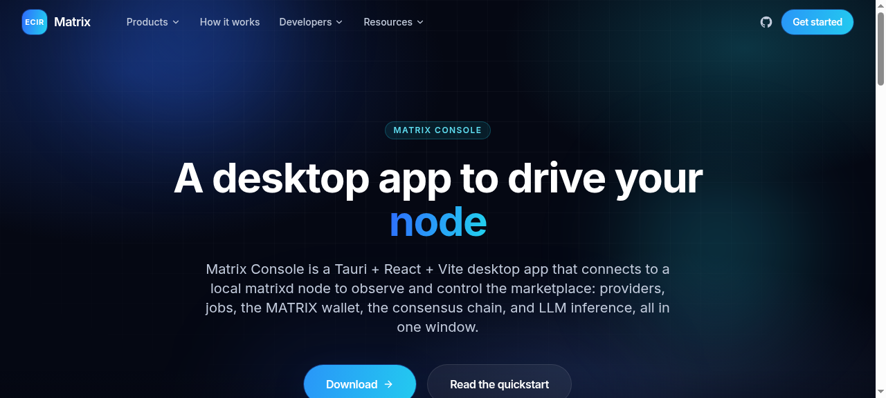
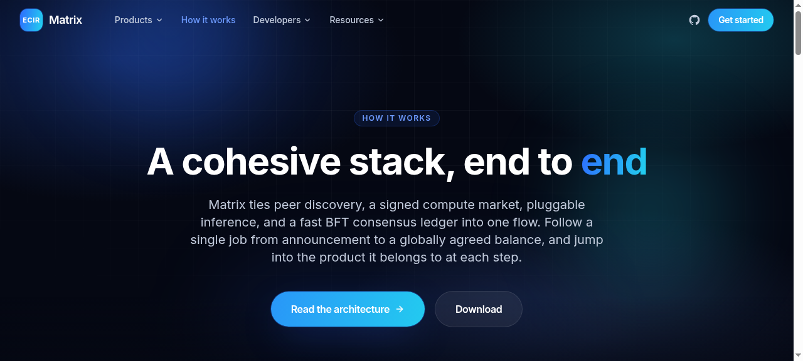
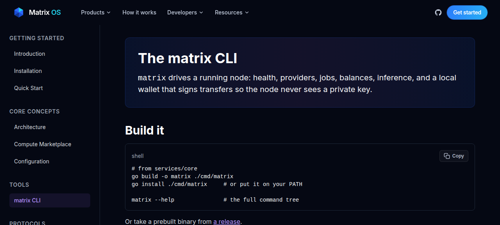
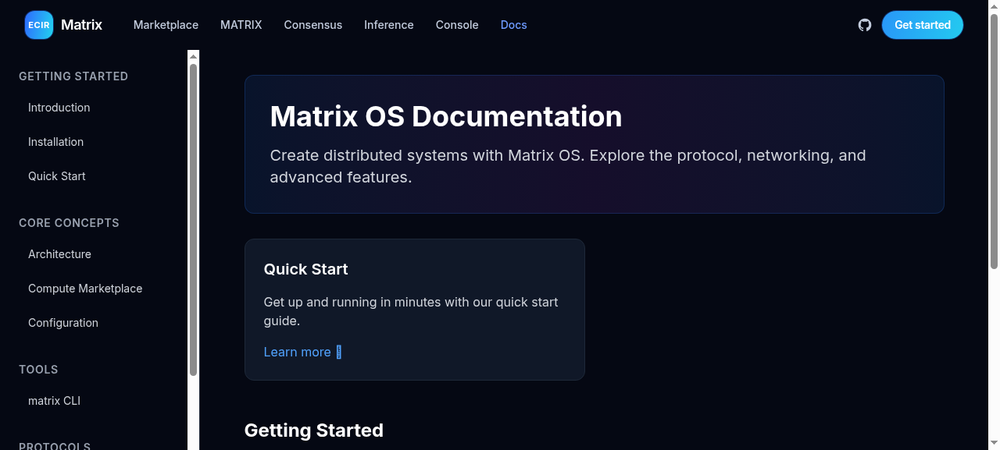

# Matrix OS

Matrix OS is a peer-to-peer network for decentralized LLM compute. People leave their
idle computers running to join the network like a blockchain node and contribute LLM
compute to the network. Anyone can buy LLM compute and API responses with
cryptocurrency, and the people who provide compute get paid by the network.

This repository is a polyglot monorepo that consolidates the Matrix OS projects into a
single tree. Each subproject keeps its own toolchain and its own README; this root
document describes the layout and how to build and test each piece.

## Monorepo layout

- [`services/core`](services/core/README.md) — Matrix Core, the Go P2P daemon that turns any machine into a Matrix node.
- [`proto`](proto/README.md) — Matrix Proto, the buf-managed Protocol Buffers definitions shared across the network.
- [`apps/web`](apps/web) — the Next.js marketing website (ecirlabs-web).
- [`apps/console`](apps/console/README.md) — Matrix Console, a Tauri + React + TypeScript + Vite desktop app that connects to a local `matrixd` node to observe and control the marketplace (providers, jobs, wallet/token, consensus, and LLM inference).
- [`contracts`](contracts/README.md) — the Hardhat project for wMATRIX, the bridged ERC-20 mirror of the native MATRIX coin that lets the asset list on exchanges (the native coin on the Go L1 remains the single source of truth for balances).

## Screenshots

The marketing site now uses a multi-page information architecture: a concise landing page
routes out to dedicated product pages. Together with the desktop app, the screenshots below
tell the accurate native-first story. Native MATRIX is the coin of the Go consensus L1 and
the single source of truth for balances, capped at 1,000,000,000 whole MATRIX at 9 decimals.
wMATRIX is the bridged ERC-20 mirror that lets the asset list on exchanges (it is not the
settlement token). The network runs fast leader-based BFT consensus that agrees one global
ledger, offers LLM inference through a local runner and a provider-API proxy, ships the
`matrix` CLI, and the Matrix Console desktop app. Images live in
[`docs/screenshots`](docs/screenshots).

### Marketing site (`apps/web`)


*The Matrix OS home page: a concise landing that routes visitors to the product pages.*


*Compute Marketplace: peer-to-peer capacity announce and discovery with signed jobs that settle in native MATRIX.*


*MATRIX Token: native coin cards (name, symbol, decimals, and 1,000,000,000 max-supply cap) plus the bridged wrapped ERC-20 mirror panel for exchange listing.*


*Consensus: fast leader-based BFT that agrees one global ledger.*


*LLM Inference: two ways to contribute compute, a local runner and a provider-API proxy.*


*Console: the product page for the Matrix Console desktop app.*


*How It Works: the end-to-end walkthrough of the network.*


*The `matrix` CLI product and reference page.*


*The documentation page.*

### Console (`apps/console`)


*Matrix Console: providers, jobs, native MATRIX wallet, consensus, and inference tabs in one window.*

## Repository tooling

A root [`go.work`](go.work) ties the Go modules (`services/core` and `proto`) together so
they resolve consistently in workspace mode. A single merged [`.gitignore`](.gitignore)
covers the build artifacts of every subtree.

## Build and test

Each toolchain is invoked from its own subdirectory.

### Go — `services/core`

```sh
cd services/core
go build ./...
go test ./...
```

### Protocol Buffers — `proto`

```sh
cd proto
buf lint
buf generate
```

### Web — `apps/web`

```sh
cd apps/web
corepack yarn install --frozen-lockfile
corepack yarn lint
corepack yarn build
```

### Console — `apps/console`

```sh
cd apps/console
corepack yarn install
corepack yarn build   # tsc --noEmit && vite build -> dist/
corepack yarn dev     # Vite dev server on http://localhost:5173
```

The console is a Tauri + React + Vite desktop app. The web frontend builds and
runs everywhere; the native desktop bundle (`corepack yarn tauri build`)
additionally needs the WebKitGTK/libsoup system libraries. See the
[console README](apps/console/README.md) for the connection configuration and
the documented native-build limitation.

### Contracts — `contracts`

```sh
cd contracts
npm install
npx hardhat compile
npx hardhat test
```

## License

Matrix OS is [MIT licensed](LICENSE).
