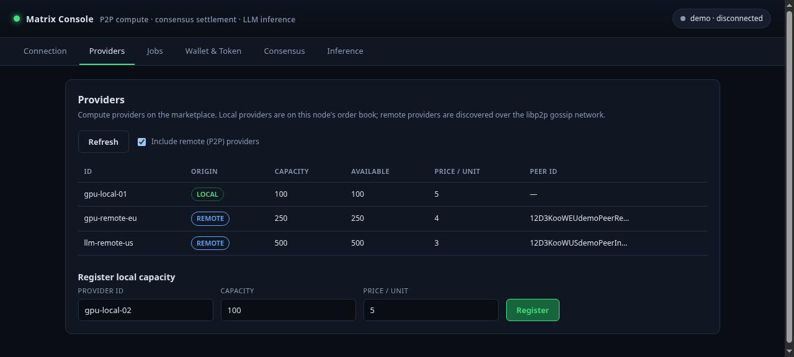
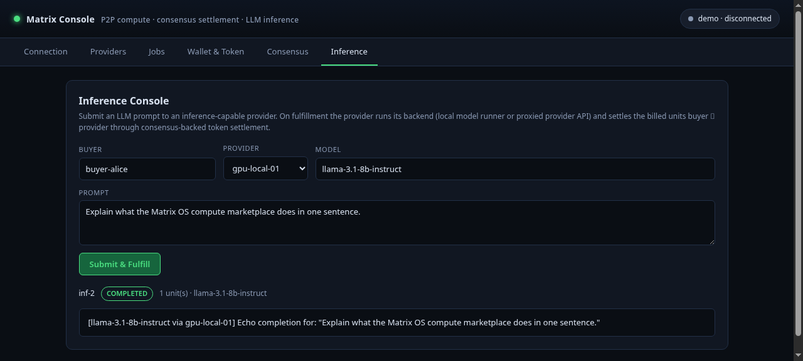
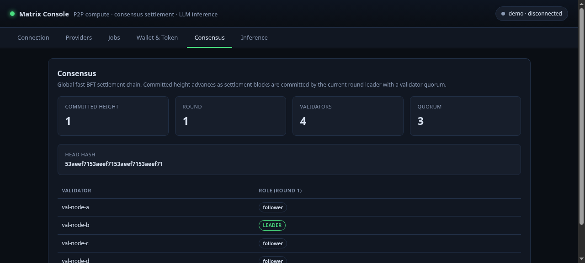
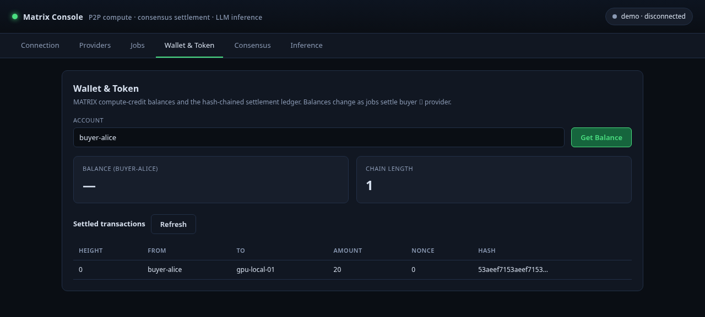

# Matrix Console

> The graphical interface for Matrix OS — A Peer-to-Peer Operating Fabric for AI Agents

## 🔗 Related Repositories
- [matrix-proto](https://github.com/ecirlabs/matrix-proto) - Wire contracts for Souls, Matrices, and transport protocols
- [matrix-core](https://github.com/ecirlabs/matrix-core) - Runtime engine for Wasm, P2P, and Matrix logic
- [matrix-console](https://github.com/ecirlabs/matrix-console) - This repository: GUI for creation, observation, and control

## 🌟 Overview

Matrix OS is a groundbreaking platform that combines digital twin creation (Souls) with agent simulation environments (Matrices) to enable unprecedented AI experimentation and automation.

## 🎮 About Matrix Console

This repository contains the graphical user interface for Matrix OS, providing an intuitive desktop application for creating, managing, and observing AI agents and their simulations. Key responsibilities include:

- **Soul Management**: Create and fine-tune your digital twins through an elegant GUI
- **Matrix Visualization**: Watch real-time agent interactions through dynamic graph visualizations
- **Live Monitoring**: Stream conversations and observe emergent behaviors as they happen
- **Simulation Control**: Drag-and-drop Souls into Matrices and control simulation parameters

The console connects to local `matrixd` nodes via WebSocket/gRPC, providing a seamless bridge between the user interface and the Matrix OS core infrastructure. Built with Tauri, it delivers native performance across Windows, macOS, and Linux.

## 🧠 Core Components

### Soul OS: Digital Twin Creation

Soul OS enables you to create and train personalized AI agents (Souls) that authentically mirror your decision-making, values, and personality. Your Soul learns and evolves through:

- **Guided Training**: Provide memories, goals, values, and persona traits
- **Active Learning**: Regular decision-making scenarios that shape behavior
- **Natural Growth**: Continuous learning from interactions with other agents

#### Integration Options
- 💬 Rich GUI chat interface
- 🔌 RESTful API endpoints
- 🤖 MCP server for chatbot integration

### Matrix OS: Agent Simulation Platform

Matrix OS provides controlled environments (Matrices) where Souls can interact, learn, and demonstrate emergent behaviors. Key features:

- **Environment Creation**: Design custom simulation spaces with specific rules
- **Agent Orchestration**: Deploy multiple Souls to interact autonomously
- **Real-time Observation**: Monitor agent dynamics and emergent properties
- **Continuous Learning**: Souls evolve through Matrix interactions

## 💡 Use Cases

### For Soul OS

Stop writing endless prompt instructions! Your Soul can:
- Engage with other AI agents using your personal decision principles
- Handle follow-up conversations autonomously
- Learn and adapt from each interaction
- Maintain consistency with your values and communication style

### For Matrix OS

Create safe spaces to explore:
- 📊 Policy impact analysis
- 🤝 Team dynamics and collaboration scenarios
- 🚀 Product adoption simulations
- 🔬 Technical agent performance testing

## 🛠 Technical Architecture

- **Frontend**: React + TypeScript + Vite + Tauri
- **Real-time Communication**: WebSocket/gRPC
- **Cross-platform**: Windows, macOS, and Linux support

### Key Features
- Create and edit Soul properties (memories, persona, values)
- Drag-and-drop Soul deployment into Matrices
- Interactive agent relationship visualization
- Live chat streaming with rich GUI
- Real-time event monitoring and simulation analytics
- Local `matrixd` node connectivity

## 🎯 Value Proposition

- **Mirror Yourself**: Create authentic digital twins that represent your true self
- **Simulate Your World**: Test scenarios in safe, controlled environments
- **Observe & Learn**: Gain insights from emergent behaviors and interactions
- **Automate Interactions**: Let your Soul handle AI conversations while maintaining your principles

## 🖼 Screenshots

The console runs in any modern browser via the Vite dev server (and inside a
Tauri WebView on the desktop). These captures are of the running app driving the
built-in demo backend, which mirrors the real `matrixd` settlement semantics.

### Node connection


### Providers (local + remote P2P)


### Inference console


### Consensus status


### Wallet & settled token ledger


## 🚀 Getting Started

### Stack

- **Frontend**: React 18 + TypeScript + Vite
- **Desktop shell**: Tauri 1.x (Rust) under [`src-tauri/`](src-tauri)
- **Transport**: a dependency-free typed client (`src/api/client.ts`) that
  speaks the [Connect protocol](https://connectrpc.com) over `fetch` to a local
  `matrixd` node. It targets the `matrix.market.v1.MarketService` and
  `matrix.inference.v1.InferenceService` gRPC surfaces (see the
  [`proto`](../../proto) package). An in-memory demo backend
  (`src/api/demo.ts`) implements the same client interface so the UI can be
  explored and screenshotted without a running daemon.

### Prerequisites

- Node 22 with Yarn via Corepack (`corepack enable`)
- For the native desktop build only: a Rust toolchain and the Tauri system
  libraries (see the limitation note below)

### Install & run the web frontend

```sh
cd apps/console
corepack yarn install
corepack yarn dev      # Vite dev server on http://localhost:5173
```

Then open http://localhost:5173. Build a production bundle to `dist/` with:

```sh
corepack yarn build    # tsc --noEmit && vite build -> dist/
corepack yarn preview  # preview the built bundle
```

### Connecting to a matrixd node

By default the console starts in **Demo (in-memory)** mode so it renders
meaningful state with no daemon. To connect to a real node, run `matrixd`
(from [`services/core`](../../services/core)) and, in the **Connection** tab,
switch the backend to **Live matrixd** and point the endpoints at your node:

- **MarketService URL** — default `http://127.0.0.1:9091`
- **InferenceService URL** — default `http://127.0.0.1:9092`

The client posts Connect-protocol JSON to
`/{package}.{Service}/{Method}` (e.g. `POST
http://127.0.0.1:9091/matrix.market.v1.MarketService/ListProviders`). Raw gRPC
uses HTTP/2 trailers a browser cannot produce, so expose the node's gRPC
services behind a Connect/gRPC-web handler when connecting from the browser
frontend; inside the Tauri WebView the same HTTP path is used.

### Desktop build (Tauri)

```sh
corepack yarn tauri dev     # run the desktop shell against the Vite dev server
corepack yarn tauri build   # bundle a native desktop app from dist/
```

### ⚠️ Native desktop build limitation in this environment

The Tauri shell (`src-tauri/`) is fully wired — `Cargo.toml`,
`tauri.conf.json`, `src/main.rs`, `build.rs`, and icons are all present and
correct — and the **web frontend builds and runs completely**
(`corepack yarn build` emits `dist/`, `corepack yarn dev` serves on port
`5173`).

A **native** `cargo check` / `tauri build` cannot complete in the current
sandbox because the required Linux system libraries are not installed. Running
`cargo check` in `src-tauri/` fails while building the `soup2-sys` crate:

```
error: failed to run custom build command for `soup2-sys v0.2.0`
  ...
  The system library `libsoup-2.4` required by crate `soup2-sys` was not found.
  Package 'libsoup-2.4', required by 'virtual:world', not found
```

`pkg-config` reports these Tauri/WebKitGTK dependencies as **missing** on this
host: `webkit2gtk-4.1`, `webkit2gtk-4.0`, `libsoup-3.0`, `libsoup-2.4`,
`javascriptcoregtk-4.1`, and `gtk+-3.0`. This is an environment limitation, not
a code defect: the failure is in a system-library probe, before our Rust code
is type-checked. On a machine with the WebKitGTK/libsoup development packages
installed (e.g. `libwebkit2gtk-4.1-dev`, `libsoup-3.0-dev`, `libgtk-3-dev` on
Debian/Ubuntu), `cargo check` and `yarn tauri build` complete normally.

## 🤝 Contributing

Follow the monorepo conventions. Frontend changes must pass
`corepack yarn build` (type-check + Vite build). Keep the Rust shell minimal;
application logic belongs in the React/TypeScript frontend and the typed client
in `src/api/`.

## 📄 License

MIT — see [LICENSE](LICENSE). 