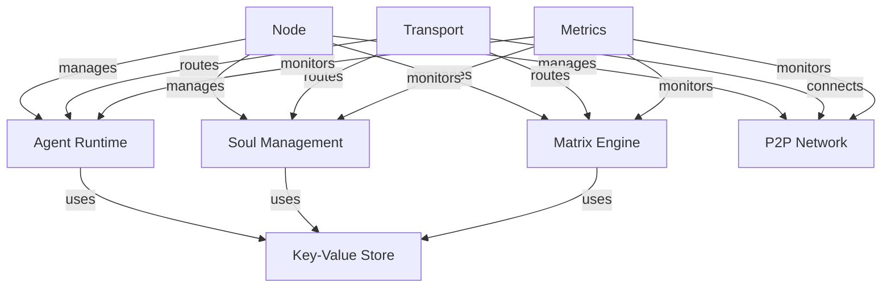

# Matrix Core

Matrix Core is the foundational runtime for the Matrix ecosystem, enabling peer-to-peer Soul interactions and Matrix simulations. Written in Go, it provides a distributed runtime environment that can transform any computer into a Matrix node, capable of hosting Souls, executing Matrices, and participating in decentralized message exchange.

## 🏗 Architecture

Matrix Core follows a modular architecture with clear separation of concerns:

### Core Components

| Component | Package | Description |
|-----------|---------|-------------|
| Node Lifecycle | `internal/node` | Configuration, startup, shutdown, and component orchestration |
| Agent Runtime | `internal/agent` | WebAssembly execution environment with resource controls |
| Soul Management | `internal/soul` | Soul state, memory, and lifecycle management |
| Matrix Engine | `internal/matrix` | Simulation environment with rules and event processing |
| P2P Networking | `internal/p2p` | Peer discovery and networking via libp2p |
| Message Transport | `internal/transport` | Message routing and event distribution |
| Key-Value Store | `internal/kv` | Persistent storage using Pebble |
| Compute Marketplace | `internal/market` | Compute-credits ledger and paid compute-job marketplace: providers advertise capacity, buyers pay for jobs, credits settle to providers on completion |
| Token Settlement | `internal/token` | ed25519-signed transfers recorded in a SHA-256 hash-chained, Pebble-backed log; the signed entrypoint (`SettledLedger`) credits move through |
| P2P Marketplace Exchange | `internal/marketexchange` | libp2p gossip layer for provider discovery and signed job/settlement messages |
| Global Consensus | `internal/consensus` | Fast leader-based BFT over a fixed validator set: the network-wide, agreed, ordered ledger that settlement flows through (see below) |
| Metrics | `internal/metrics` | Prometheus metrics collection |

### Directory Structure

```
matrix-core/
├── cmd/
│   └── matrixd/           # Main daemon executable
├── internal/
│   ├── agent/            # WebAssembly runtime and host functions
│   ├── soul/             # Soul state and lifecycle management
│   ├── matrix/           # Simulation engine and rule processing
│   ├── p2p/              # libp2p networking and peer discovery
│   ├── transport/        # Message routing and event distribution
│   ├── kv/              # Key-value storage with Pebble
│   ├── market/          # Compute-credits ledger and compute-job marketplace
│   ├── token/           # ed25519-signed, hash-chained token settlement
│   ├── marketexchange/  # libp2p gossip provider discovery + signed messages
│   ├── consensus/       # Fast leader-based BFT global consensus ledger
│   ├── metrics/         # Prometheus metrics collection
│   └── node/            # Node lifecycle and configuration
├── .github/             # GitHub Actions and configs
└── configs/             # Configuration templates
```

### Component Interactions



### Key Features

1. **Node Management** (`internal/node`)
   - Configuration management
   - Component lifecycle
   - Graceful shutdown
   - Resource coordination

2. **Agent Runtime** (`internal/agent`)
   - WebAssembly execution
   - Resource limits
   - Host functions
   - Memory management

3. **Soul Management** (`internal/soul`)
   - Soul state persistence
   - Memory management
   - Lifecycle control
   - Training coordination

4. **Matrix Engine** (`internal/matrix`)
   - Rule processing
   - Event handling
   - Agent coordination
   - State management

5. **P2P Network** (`internal/p2p`)
   - Peer discovery
   - Connection management
   - Stream handling
   - NAT traversal

6. **Message Transport** (`internal/transport`)
   - Message routing
   - Event distribution
   - Pub/sub handling
   - Protocol management

7. **Storage** (`internal/kv`)
   - Persistent storage
   - State management
   - Data replication
   - Transaction handling

8. **Metrics** (`internal/metrics`)
   - Performance monitoring
   - Resource tracking
   - Event counting
   - Health checks

## 🌐 Global Consensus Ledger (`internal/consensus`)

Settlement is authoritative and network-wide. Earlier iterations settled credits
**per node, pairwise**: a signed transfer committed to one node's independent
token chain (its local nonce + chain head), so a gossiped settlement applied only
on the single counterparty node it was built against and there was no
network-wide agreement on ordering or balances. That path
(`internal/marketexchange`) still exists as a best-effort message bus, but it is
**no longer the source of truth**.

The authoritative ledger is now a **fast, leader-based BFT consensus** over a
**fixed validator set**, built for **low latency (speed is the priority) with no
proof-of-work**:

- **Fixed validator set.** Validators are ed25519 identities (reusing
  `token.Account`). Every node derives the identical, deterministically-ordered
  set from the configured validator keys, so all nodes agree on the schedule
  without extra coordination.
- **Round-robin leader.** The leader for a round is `validators[round mod N]`.
  Rounds advance on a short timeout, so leadership rotates and progress continues
  even if a leader is silent.
- **Single-round fast path.** The leader batches pending signed
  `token.Transaction` values into a `Block{Height, Round, PrevBlockHash, Txs,
  ProposerID, Signature}` and broadcasts a signed proposal on
  `matrix.consensus.v1/proposal`. Validators verify it (correct leader for the
  round, every tx signature, prev-block-hash link) and broadcast signed votes on
  `matrix.consensus.v1/vote`. On collecting a **quorum of >2/3 of the set
  (2f+1 of 3f+1)** a node **commits immediately** — there is no separate commit
  round — and pipelines the next round.
- **Replicated, hash-linked ledger.** Each committed block extends a SHA-256
  hash-linked chain persisted in Pebble under the `consensus/*` prefix (disjoint
  from `token/*` and `market/*`), and its ordered transactions are applied
  deterministically to the `market.Ledger`. Every honest node therefore reaches
  the **same ordered log and the same balances**. Replay protection comes from a
  committed-transaction dedup gate: a finalized transaction can never be applied
  twice.
- **Canonical signing.** Proposals and votes are ed25519-signed over a
  length-prefixed canonical encoding in the exact style of
  `token.Transaction.SigningBytes`, so no two distinct messages collide.

**Settlement now flows through consensus.** `Node.SettleThroughConsensus`
submits a signed transfer into the engine; when a committed block includes it,
**every** node reflects the transfer on its market ledger. The engine is
constructed over the gossip transport in `internal/node`, started under the node
context, and stopped by cancelling that context and waiting for its loops to
exit (the same lifecycle as the marketplace exchange). A `Transport` interface
abstraction lets the multi-node test wire N engines to an in-memory gossip bus;
that test asserts all nodes commit an identical ordered log, converge to
identical balances, make progress across leader rotation, and reject
badly-signed/replayed transactions — and it passes under `go test -race`.

## 🔧 Configuration

Matrix Core uses YAML configuration for node settings:

```yaml
network:
  listen_addr: "0.0.0.0:9000"
  bootstrap_peers:
    - "/ip4/1.2.3.4/tcp/9000/p2p/QmExample..."

storage:
  engine: "pebble"
  path: "/var/lib/matrix/data"

security:
  enable_acls: true
  allow_unsigned_agents: false

consensus:
  # Fixed validator set as hex-encoded account IDs (ed25519 public keys). This
  # node's own consensus identity is always included, so an empty list yields a
  # functioning single-validator consensus for a solo/dev node. Every node
  # configured with the same list derives the identical leader schedule.
  validators:
    - "b1946ac92492d2347c6235b4d2611184..."
    - "3c363836cf4e16666669a25da280a1865..."
```

## 🚀 Getting Started

> **Generated Protocol Buffers stubs are required.** The external marketplace
> gRPC API (`internal/marketapi`, exposing `matrix.market.v1.MarketService`)
> imports Go stubs generated from `proto/`. Those stubs live under `proto/gen`,
> which is gitignored and **not** committed, so a fresh checkout must generate
> them before building:
>
> ```bash
> cd ../../proto && buf generate   # writes proto/gen/go/matrix/**
> ```
>
> Or from the repo root, run `make proto` (or `make build`), which runs
> `buf generate` and then builds this module.

1. Build the daemon (after generating proto stubs, see above):
   ```bash
   go build ./cmd/matrixd
   ```

2. Initialize a new node:
   ```bash
   ./matrixd --init
   ```

3. Start the node:
   ```bash
   ./matrixd
   ```

## 📈 Monitoring

Matrix Core exposes metrics via Prometheus:

- Soul metrics (memory, state)
- Matrix metrics (events, rules)
- Agent metrics (resources, execution)
- P2P metrics (peers, bandwidth)
- System metrics (CPU, memory)

## 📄 License

MIT License - See [LICENSE](LICENSE) for details.